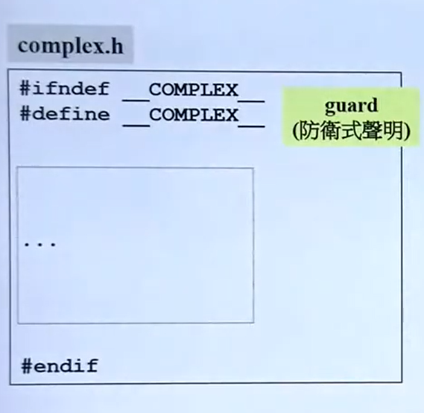
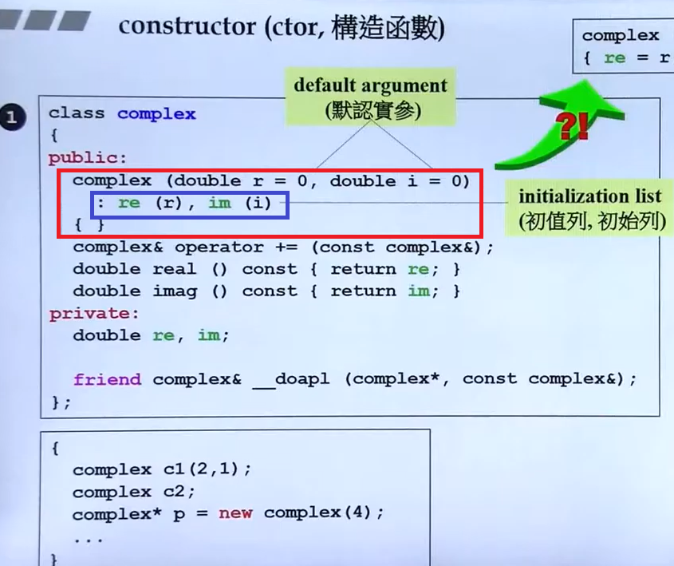
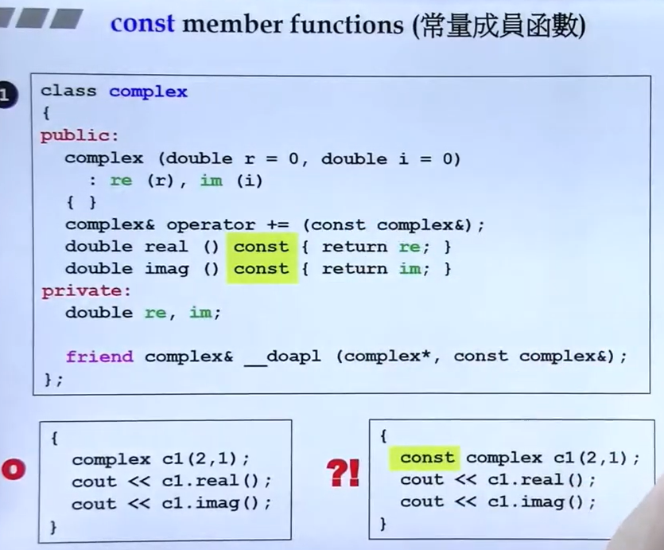
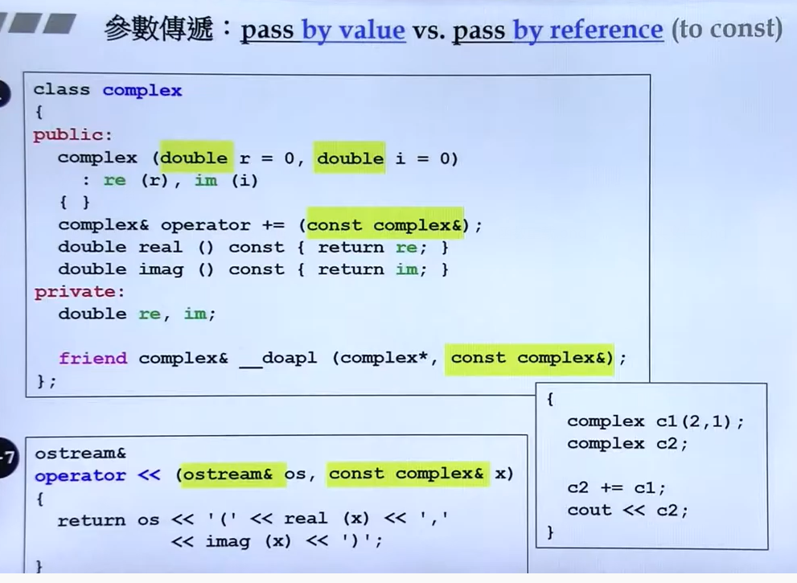
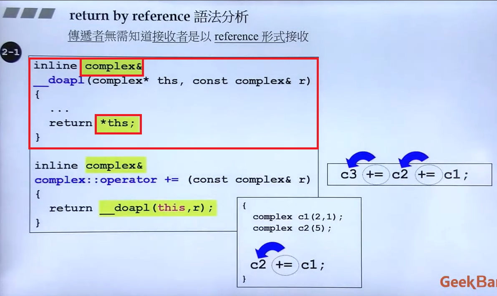
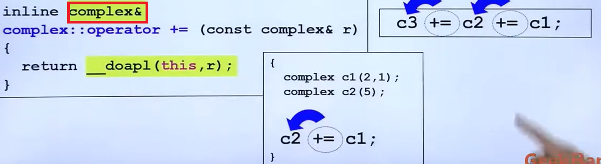
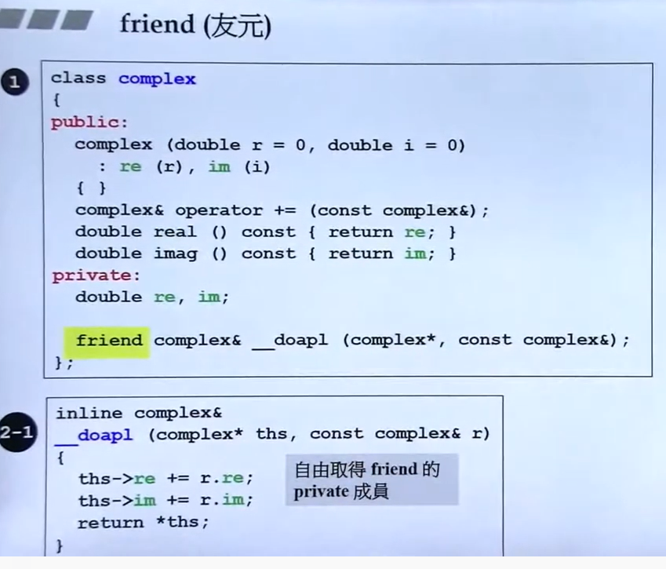
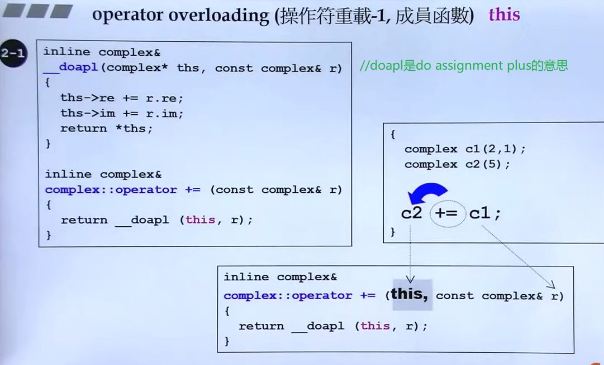
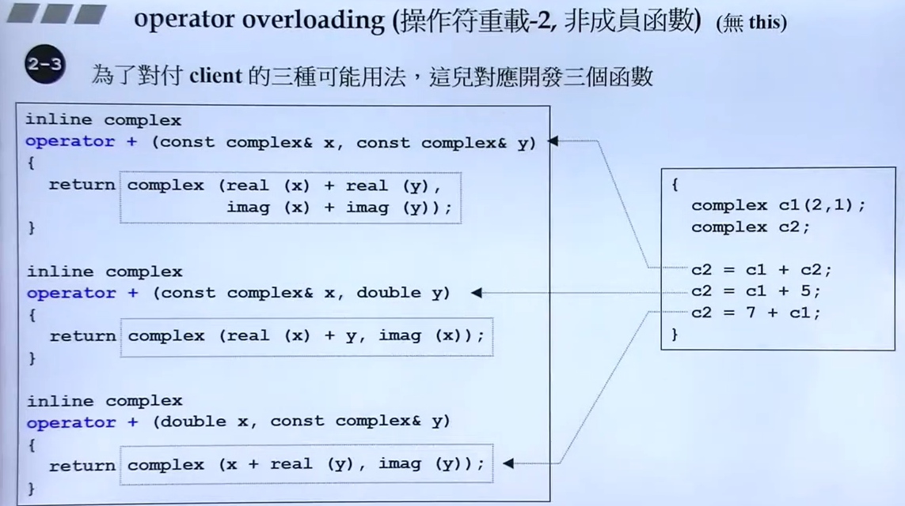
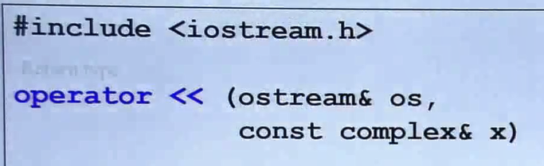

## 防卫式头文件说明



这样反复include头文件就不会重复进入文件，且与先后include顺序无关


## 模板

```cpp
template<typename T>
class complex
{
public:
    complex(T r=0,T i=0):re(r),im(i){}
private:
    T re,im;
}

int main()
{
    complex<double> c1(2.5,1.0);
    complex<int> c2(2,6);
    return 0;
}
```


模板可以通过一份代码处理不同的数据类型


## 构造函数




## 函数的重载

构造函数可以有多个：

```cpp
double real() const {return re;}	// 1
void real(double r) {re = r;}		// 2
// 但编译后的实际名称是：
// ?real@Complex@@QBENXZ
// ?real@Complex@@QAENABN@Z
```

但以下情况不可重载：


因为两个函数都可以调用，第一个函数参数有默认值，第二个函数没有参数，编译器不知道该用哪个


## 将构造函数放在private区——Singleton


这样做的目的是使该类只能有一个实例，由于构造函数在private区域，外部无法创建实例，只能通过GetInstance获取对象


## 常量成员函数



* 加上const说明该函数不会改变参数值（写的时候如果函数不会改变值就要加const）

* 如果当前传入的参数是一个常量，说明该参数不可被改变。如果函数忘记加const，说明函数可能会改变参数值，这样是无法传入常量的。

* 即：常量函数可传入常量/变量，但是常量只能被传入常量函数。


## 参数传递



当数据量很大时，直接参数传递会很慢，传递的动作就是将数据压到栈中，所以最好所有的参数传递都用引用（其底部就是指针，仅4个字节）。

另外，由于使用引用，代码一改可能就会出错，因此如果不希望别人改动这个参数，就加上const。



返回的是指针所指向的数据，但是返回的声明却说返回的是引用。这就是——传递者无需知道接收者是引用接收。

在上图中的下半部分：



对于c2+=c1来说，返回值是怎样无所谓。但是这个函数返回类型要用引用的原因是：对于c3+=c2+=c1来说，c2+=c1后的返回值会作为c3+=c2的右值再进行传递。


## 友元



被声明友元的函数可以打开封装的大门，它可以获取并修改private中的数据，比通过public中的函数拿数据要快。


(md，它居然能直接用私有变量)


## 无法使用引用的情况

函数中新创建的变量无法通过引用返回，只能直接参数返回


## 操作符重载



任何成员函数都有一个影藏的this pointer，this指向调用者


## 全域函数





注意，这里返回值不是引用的原因是：返回的值是新计算的一个临时对象，不是已有变量