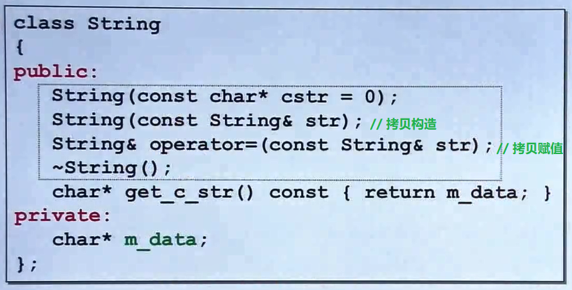
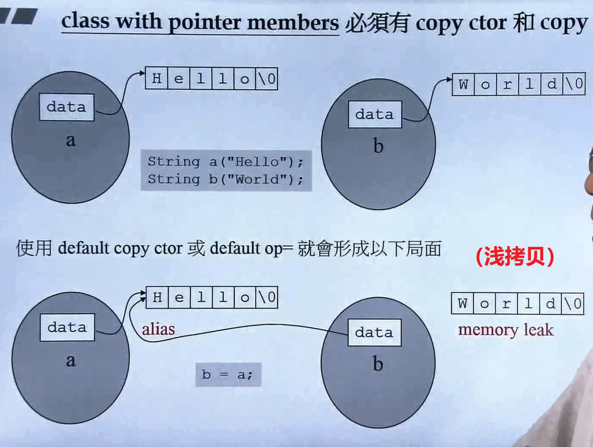

# 【7】 三大函数：拷贝构造，拷贝复制，析构

## 一、拷贝构造与拷贝赋值

只要类带有指针，一定要写这两个函数

### 1. 拷贝构造&拷贝赋值（运算符重载）调用时的区别

#### 1. 拷贝构造：

``A obj1;``
``A obj2=obj1;`` 或 ``A obj2(obj1);``

#### 2. 拷贝赋值（运算符重载）：

``A obj1;``
``A obj2;``
``obj2=obj1;``

### 2. 深拷贝与浅拷贝

之所以说：带有指针的类一定要自己定义【拷贝构造】和【拷贝赋值】函数，是因为如果不写的话，c++默认对于指针的拷贝是浅拷贝，拷贝后的两个指针会指向**同一块地址区间**。
而自己定义后进行的深拷贝，不仅拷贝指针，也拷贝指针指向的内容，拷贝后的两个指针指向**不同的内存区间**。

### 3.拷贝赋值的写法

如果要将x拷贝赋值给y（即y=x）：
1. 将y清空
2. 给y分配和x一样的大小空间
3. 将x赋值给y

# 【8】 堆、栈与内存管理

## 一、运算符重载

**为什么重载+、*、<<等符号，只能以全局函数的方式重载，而不能以成员函数的方式重载？**

类的成员函数不能对称地处理数据，只有全局函数中对象放左边/放右边都可以，如:

 $x=a+1.1$  会被转换为  $x=operator+(a, 1.1);$

 $x=1.1+a$  会被转换为  $x=operator+(1.1, a);$

而对于成员函数，对象一定要放在左边，否则：

$x=1.1+a$  会被转换为  $x=(1.1).operator+a$

为了方便运算，运算符重载作为类的成员函数是是首选的，因此`+=`以成员函数方式重载运算符

## 二、栈与堆

new出来的是动态分配的堆的空间，需要手动delete，而函数是放在栈里，用完会自动释放空间。

### 1. 生命周期

    

static声明的函数一直到程序结束才会被释放
只new不delete会造成内存泄漏

### 2. new

**new被分为三个动作**：

1. 先调用operate new这个特殊函数，其内部调用的是malloc，进行内存的分配（本例中的两个double类型，分配8字节的空间）
2. 第二个动作是将第一步的 void* 类型转型为 Complex* 类型
3. 调用构造函数，将值放到内存中（本例中的pc就是分配的内存起始地址）

### 3. delete

**delete被分为两个动作**：

1. 先调用析构函数将指针指向的内容（本例中的字符数组）删除
2. 再删除指针本身，delete内部调用的是free

**delete与free的区别**：

1.  malloc/free是c/c++标准库的函数，new/delete除了分配空间还会调用**构造函数**和**析构函数**进行初始化和清理（清理成员）。
2.  malloc/free需要手动计算类型大小且返回值是void*，new/delete可以自己计算类型大小，返回对应的指针。

## 三、VC的内存分配

### 1.  动态分配内存

* 调试模式下分配的空间固定为32+4
* 最后的内存大小要进位到最近的16的倍数大小

### 2. 动态分配数组

$(8*3)+(32+4)+(4*2)+4$

* 数组大小为3，Complex内有2个double，因此是 $4*2*3=8*3$
* debug模式固定分配的 $32+4$ 字节
* 再加上首尾两个cookie占 $4*2$ 字节
* 最后的4字节是用来表示数组的大小，此处为3

### 3. array new 搭配 array delete

* 注意，使用普通delete造成的内存泄露是下面两个指针所指的空间，而不是new分配的整块空间

