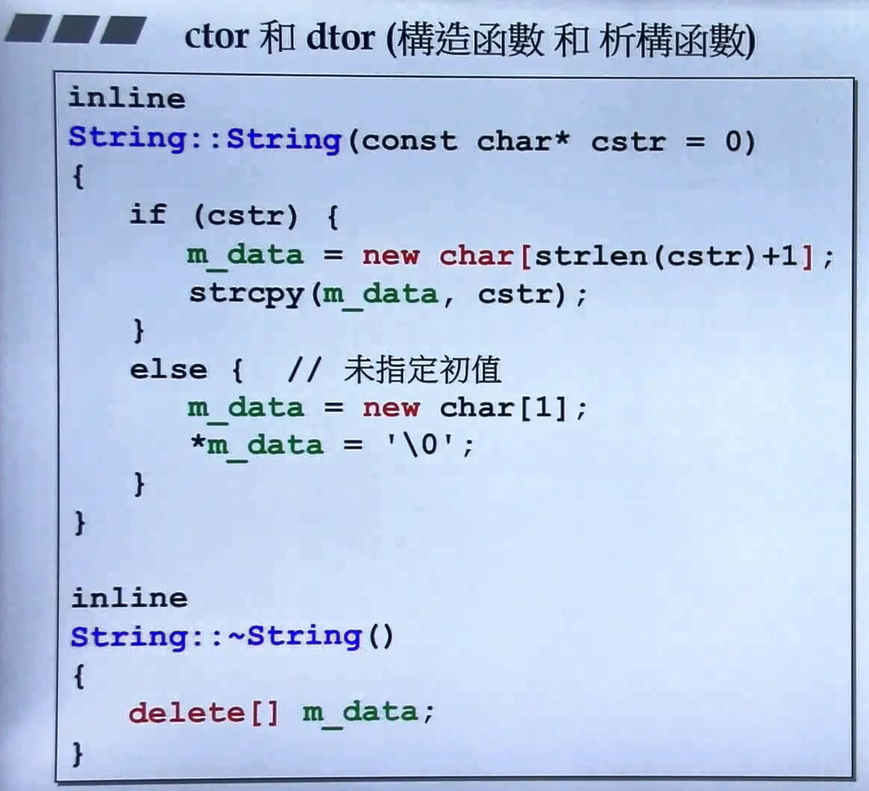
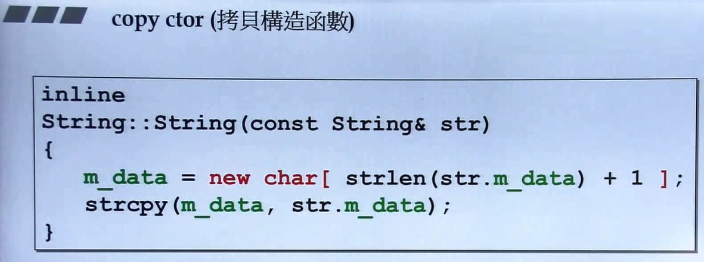
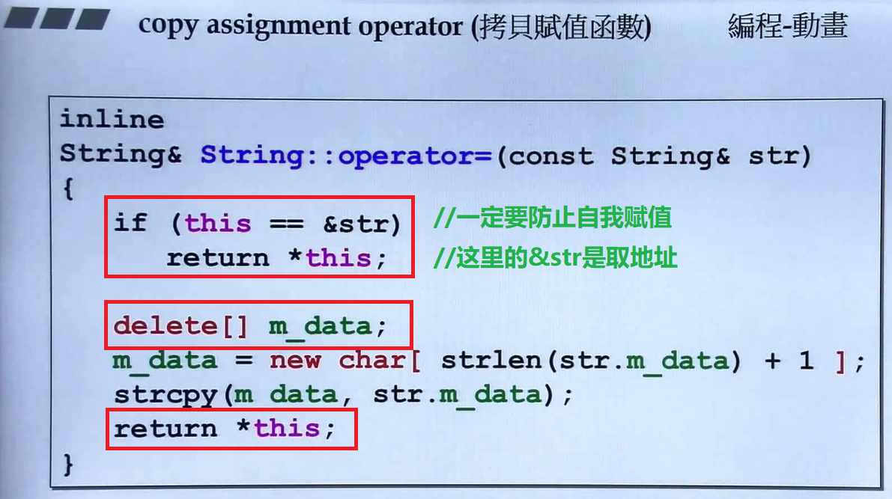

# 【9】复习String类的实现过程

## 一、String类


* 一个指针所占的大小为4字节，类的大小就是类中所用变量的大小之和。
* `String(const char* cstr = 0);` 是构造函数，传入参数未被改变所以加`const`，初始化为0
* **Class中带有指针，就一定要写拷贝构造和拷贝赋值！**
* `String(const String& str);` 是拷贝构造函数，同上加`const`，传入的参数是它自己，且优先考虑传入`reference`类型
* `String& operator=(const String& str);`是拷贝赋值，同上加`const`、传入自己、使用`reference`。来源端拷贝到目的端，因此返回类型为它自己，至于要不要加`reference`：**只要目的端不是`local object`就可以加`reference`**，即这个目的端本身就存在就可以加`reference`。
* `~String();`是析构函数。
* `char* get_c_str() const { return m_data; } ` 函数是用于实现字符串输出，返回的是指针。由于函数并没有改变目的端数据，因此要加`const`。

## 二、String的构造函数和析构函数



* 短小而频繁调用的函数建议都使用`inline`，由于调用函数的开销较大，`inline`会将函数拆解到其被调用的地方使用，如：

  ```cpp
  inline int cal(int a,int b)
  {
      return a+b;
  }
  int main()
  {
      ...
  	c=cal(a,b);
      ...
  }
  ```

  相当于

  ```cpp
  int main()
  {
      ...
  	c=a+b;
      ...
  }
  ```

* 注意`m_data=new char[strlen(cstr)+1]`的写法，+1表示字符串末尾加`\0`的结束标识。

## 三、String的拷贝构造函数



* `inline`没有副作用，如果不能`inline`编译器自己会不去做，所以可以都写上

## 四、String的拷贝赋值函数



* 一定要检查自我赋值，不仅是效率问题，还是正误性问题
* 由于目的端已经存在，所以要先`delete[]`再进行拷贝
* 拷贝完之后返回 `*this` ，是为了`a=b=c`这种连续拷贝的写法