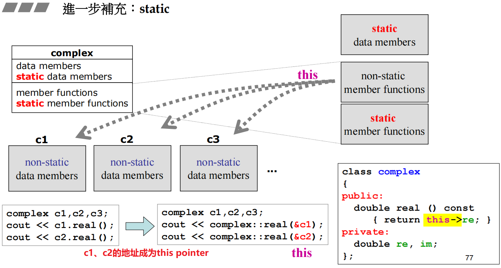
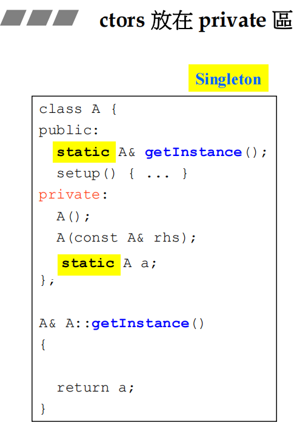

# 【10】类模板、函数模板、其他

## 一、static

静态函数是没有this pointer的，因此它无法像一般函数那样存取、处理对象里的东西，它用于存取静态数据。

*  注意静态变量一定要在类外对其进行定义，可以不给初值
* 使用静态函数的方式有两种：1. 通过对象调用 2. 通过类名调用。注意：静态函数通过对象调用时，编译器不会做传入this pointer这种隐藏动作。

## 二、设计模式Singleton

 

Singleton将构造函数放在private区域，并且创建一个对象，这样能保证永远只有一个对象。但是Singleton还不是最优，将其优化为Meyers Singleton，当不需要使用它时是没有创建对象的。在需要使用它时，调用getInstance()函数才会创建对象，且只有一个。

## 三、tmplate

### 1. class tmplate，类模板

### 2. function template，函数模板

## 四、namespace

标准库所有的东西都包装在std中，`using namespace std`表示要使用叫std的命名空间里的东西，将其全部打开。

`using std::cout`表示仅使用std中的cout。

## 五、扩展

