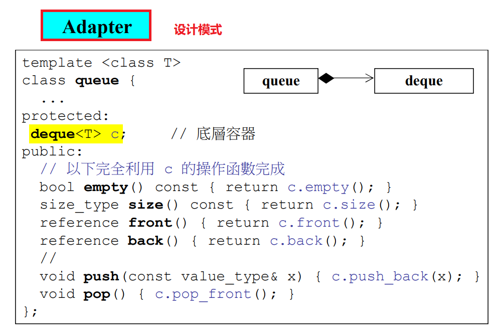
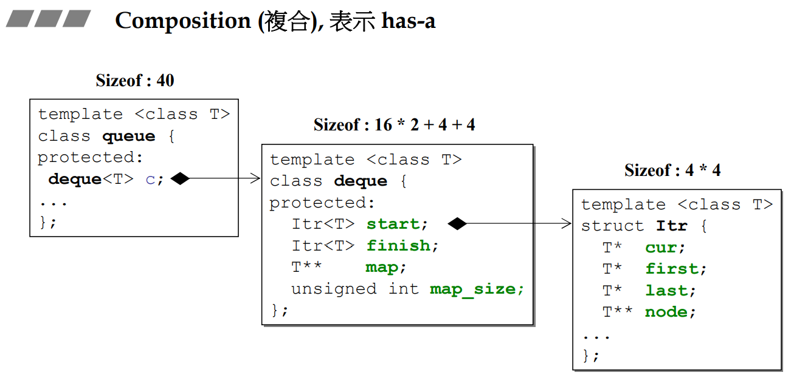
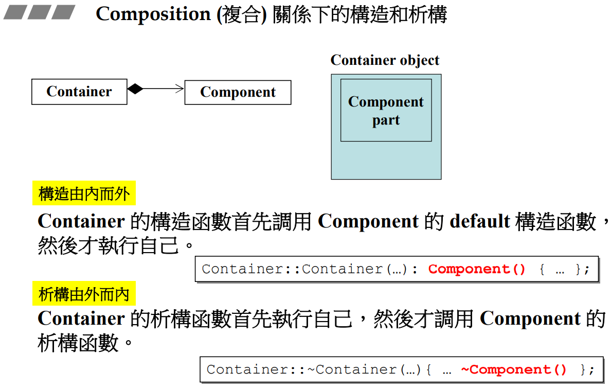
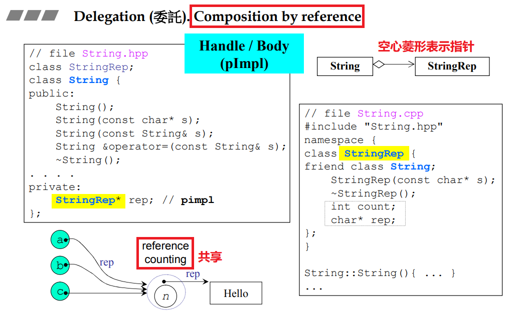
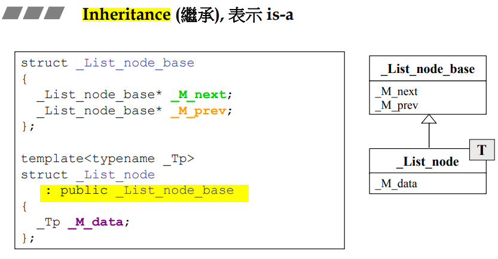
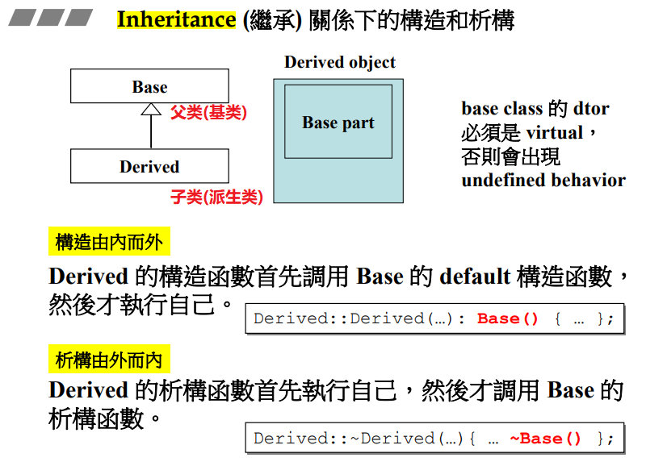
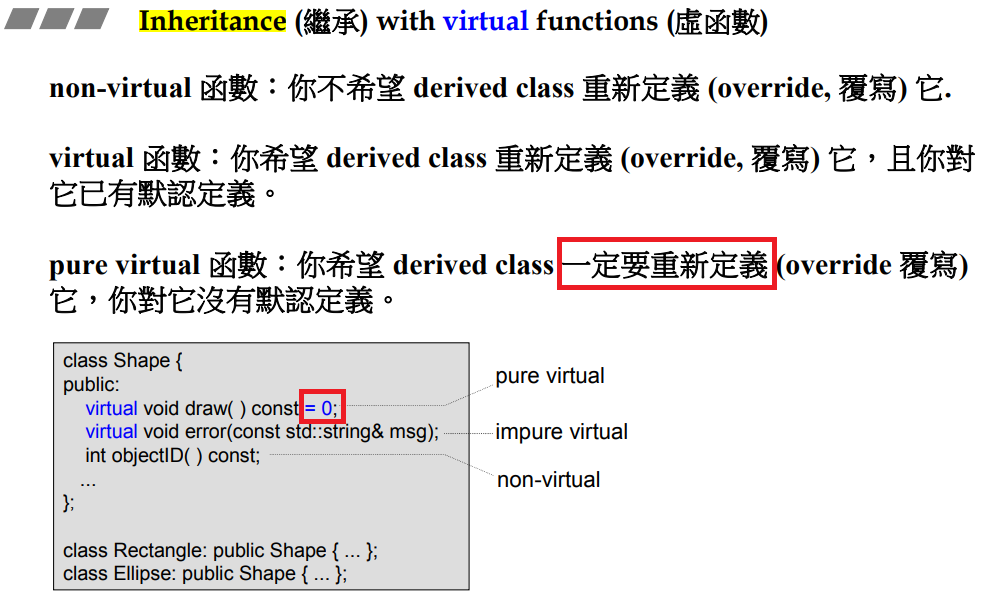
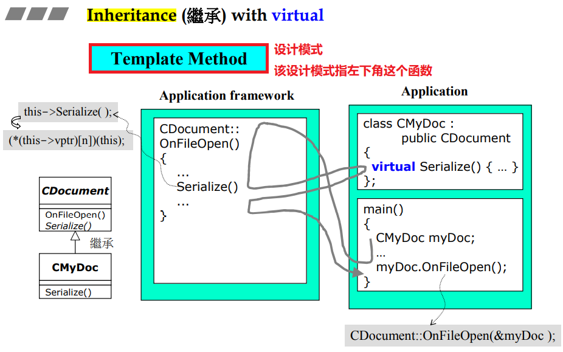
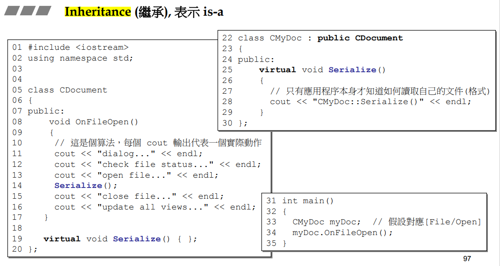
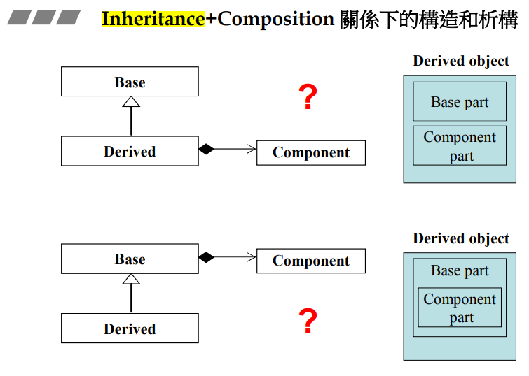

# 【11】组合与继承

## 一、Composition(复合),表示has-a

我的里面有其他东西，就叫复合（最简单如：c语言中的struct）



**设计模式Adapter：**`deque`的功能完全满足，但是用户只需要用到一部分功能，这时对其进行**改造**，改造为的`queue`就是adapt





类似穿衣服，穿的时候从里到外穿，脱的时候从外到里脱。

编译器调用的是默认的构造函数，也可以自己写要调用哪个构造函数

## 二、Delegation(委托).Composition by reference.



(学术界不讲by pointer，即使用的是指针传参，也是讲by pointer)

* 由于有指针，因此左右两边生命周期**不同步**，在左边创造之后，等到需要右边时才会去创建右边。
* 相当于左手边作为接口，具体实现全放在右手边
* a、b、c共享一份内容，当其中有人要修改内容时，应当copy一份出去改（copy on write）

## 三、Inheritance(继承),表示is-a



C++中的继承有三种：public、private、protect，其中最重要的是public



和Composition一样，构造由内而外，析构由外而内。

# 【12】虚函数与多态

## Inheritance(继承) with virtual funcions(虚函数)

成员函数前加`virtual`关键字就成为了虚函数

* 子类继承了父类的数据，而对于函数准确的说，子类继承的是父类函数的调用权





* 灰线表示执行顺序
* 应用程序框架中会大量用到这种`Template Method`写法，即先把固定的内容写好，留下无法决定的函数让它成为虚函数，让子类去定义它。(最典型的产品如MFC)

* `myDoc.OnFileOpen()`对于编译器来说的实际写法是`CDocument::OnFileOpen(&myDoc);`，这样进入到`OnFileOpen`中调用`Seralize()`时，实际调用的是`this->Seralize()`，这里`this`指的就是`myDoc`了，因此能够跑到`CMyDoc`中去调用它的`virtual Serialize()`



### Inheritance+Composition



作业（29:00）

```

```

