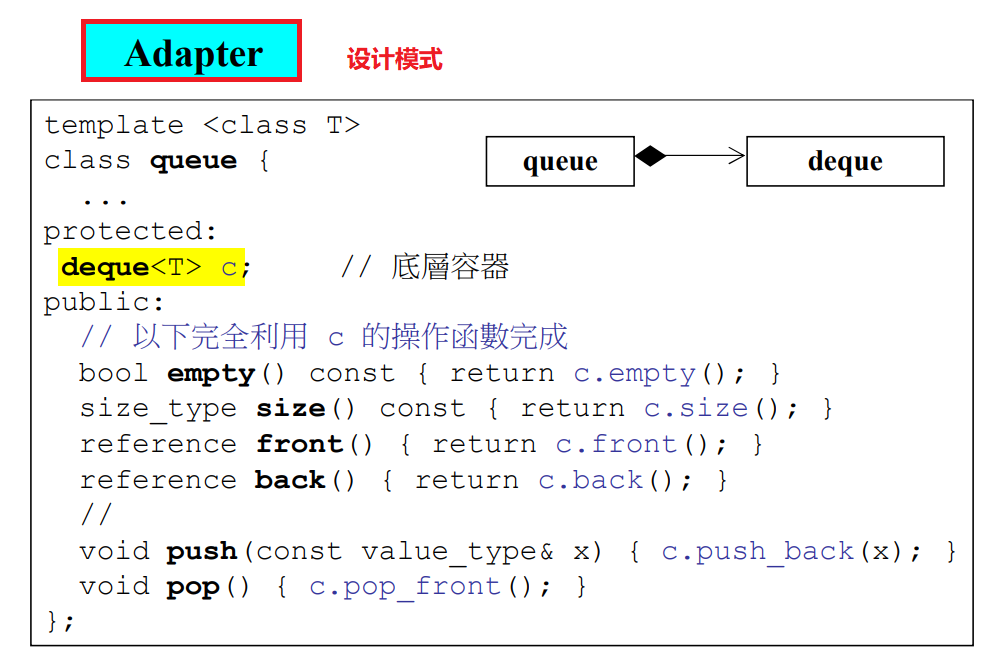
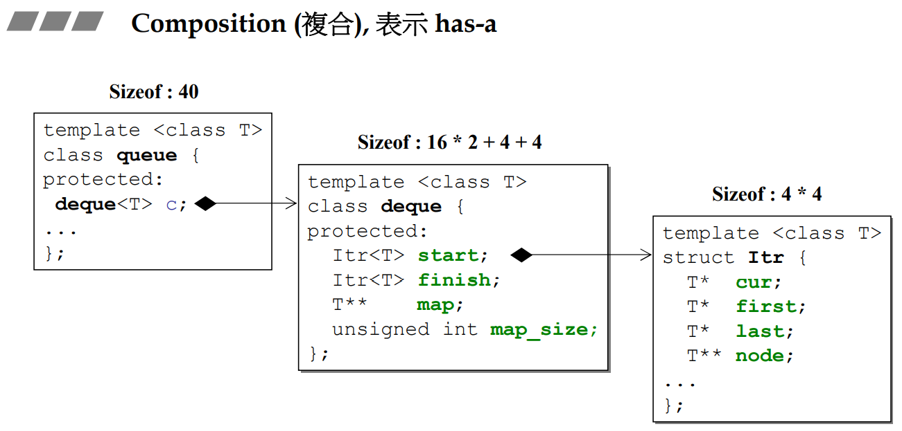
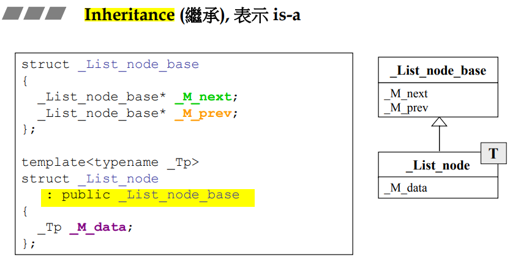
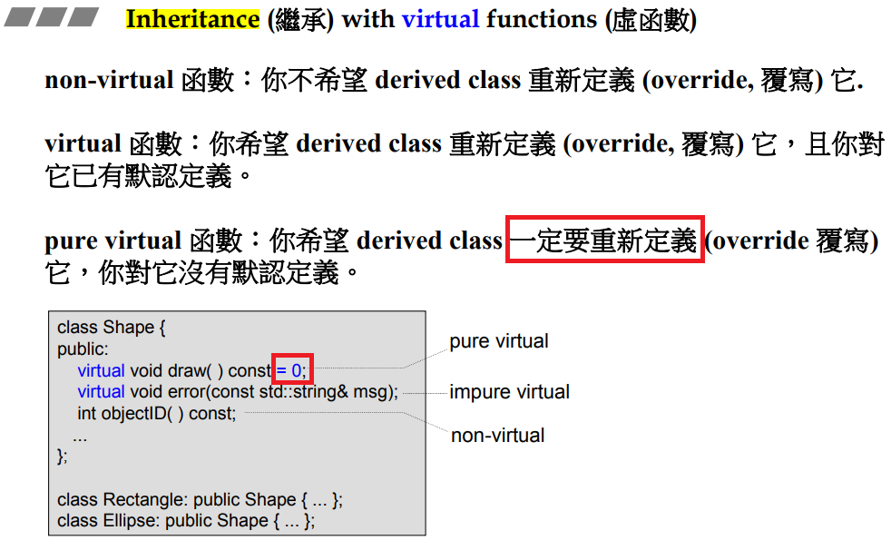
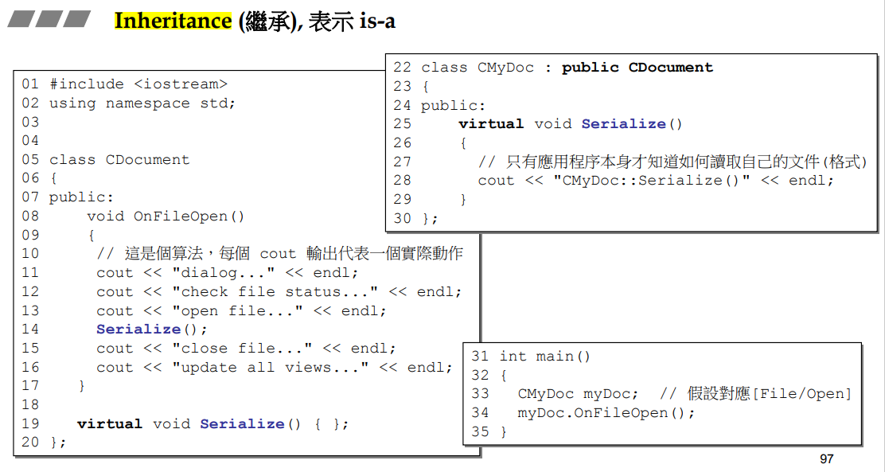
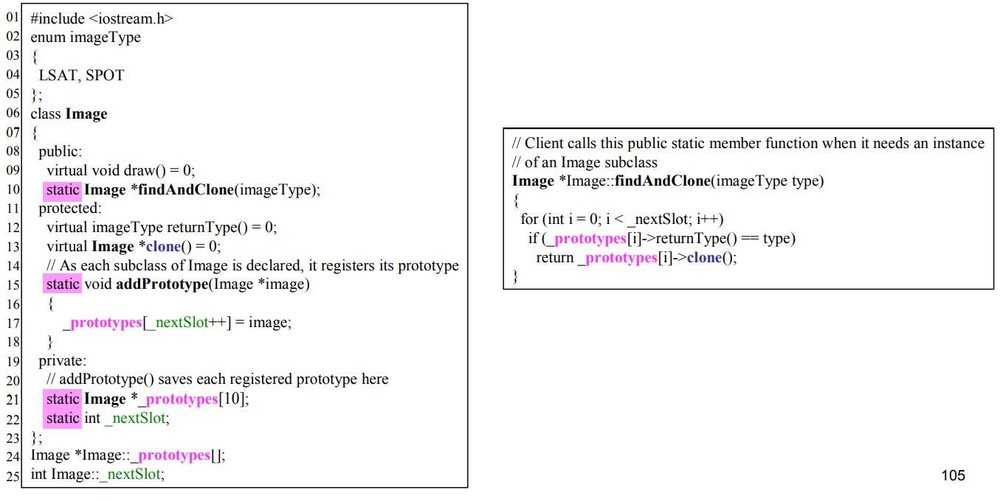

# 【11】组合与继承

## 一、Composition(复合),表示has-a

我的里面有其他东西，就叫复合（最简单如：c语言中的struct）



**设计模式Adapter：**`deque`的功能完全满足，但是用户只需要用到一部分功能，这时对其进行**改造**，改造为的`queue`就是adapt




类似穿衣服，穿的时候从里到外穿，脱的时候从外到里脱。

编译器调用的是默认的构造函数，也可以自己写要调用哪个构造函数

## 二、Delegation(委托).Composition by reference.


(学术界不讲by pointer，即使用的是指针传参，也是讲by pointer)

* 由于有指针，因此左右两边生命周期**不同步**，在左边创造之后，等到需要右边时才会去创建右边。
* 相当于左手边作为接口，具体实现全放在右手边
* a、b、c共享一份内容，当其中有人要修改内容时，应当copy一份出去改（copy on write）

## 三、Inheritance(继承),表示is-a



C++中的继承有三种：public、private、protect，其中最重要的是public


和Composition一样，构造由内而外，析构由外而内。

# 【12】虚函数与多态

## 一、Inheritance(继承) with virtual funcions(虚函数)

成员函数前加`virtual`关键字就成为了虚函数

* 子类继承了父类的数据，而对于函数准确的说，子类继承的是父类函数的调用权




* 灰线表示执行顺序
* 应用程序框架中会大量用到这种`Template Method`写法，即先把固定的内容写好，留下无法决定的函数让它成为虚函数，让子类去定义它。(最典型的产品如MFC)

* `myDoc.OnFileOpen()`对于编译器来说的实际写法是`CDocument::OnFileOpen(&myDoc);`，这样进入到`OnFileOpen`中调用`Seralize()`时，实际调用的是`this->Seralize()`，这里`this`指的就是`myDoc`了，因此能够跑到`CMyDoc`中去调用它的`virtual Serialize()`



## 二、Inheritance+Composition


### 情况一：

```cpp
//Animal.h
#pragma once
#pragma warning (disable:4996)
#include<bits/stdc++.h>
using namespace std;
class Animal
{
public:
	Animal(const char* name = 0);	// 构造函数
	Animal(const Animal& animal);	//拷贝构造
	Animal& operator=(const Animal& animal);	// 拷贝赋值（重载=）
	~Animal();
	void eat() const;
private:
	char* type;
};

//Animal.cpp
#include "Animal.h"
Animal::Animal(const char* name)	// 构造函数
{
	if (name)
	{
		type = new char[strlen(name) + 1];
		strcpy(type, name);
	}
	else
	{
		type = new char[1];
		*type = '\0';
	}
	printf("调用类Animal的构造函数\n");
}

Animal::Animal(const Animal& animal)	//拷贝构造
{
	type = new char[strlen(animal.type) + 1];
	strcpy(type, animal.type);
}

Animal& Animal::operator=(const Animal& animal)	// 拷贝赋值（重载=）
{
	if (this == &animal)	//判断自我赋值
	{
		return *this;
	}
	delete[] type;

	type = new char[strlen(animal.type) + 1];
	strcpy(type, animal.type);
	return *this;
}

Animal::~Animal()
{
	printf("调用类Animal的析构函数\n");
	delete[] type;
}

void Animal::eat() const
{
	cout << "eating..." << endl;
}

// Height.h
#pragma once
#pragma warning (disable:4996)
#include<bits/stdc++.h>
using namespace std;
class Height
{
public:
	Height();
	~Height();
	void setHeight(double d);
	double getHeight() const;
private:
	double height;
};

// Height.cpp
#include "Height.h"
Height::Height()
{
	height = 0;
	printf("调用类Height的构造函数\n");
}
void Height::setHeight(double d)
{
	height = d;
}
double Height::getHeight() const
{
	return height;
}
Height::~Height()
{
	printf("调用类Height的析构函数\n");
}

//People.h
#pragma once
#include "Animal.h"
#include "Height.h"
using namespace std;
class People : public Animal
{
public:
	People(const char* name = 0)	// 构造函数
	{
		if (name)
		{
			type = new char[strlen(name) + 1];
			strcpy(type, name);
		}
		else
		{
			type = new char[1];
			*type = '\0';
		}
		printf("调用类People的构造函数\n");
	}
	~People()
	{
		delete[] type;
		printf("调用类People的析构函数\n");
	}
	void speak() const;
	void setHeight(double height);
private:
	char* type;
	Height h;
};

// People.cpp
#include "People.h"
void People::speak() const
{
	printf("我的身高是%.1lfcm\n", h.getHeight());
}
void People::setHeight(double d)
{
	h.setHeight(d);
}

//main.cpp
#include "People.h"
int main()
{
	People man("小明");
	man.setHeight(180.0);
	man.speak();
	return 0;
}
```

**结果：**


先调用继承的基类的构造函数，再调用复合的类的构造函数。

## 三、Delegation(委托)+Inheritance(继承)

问题：如何设计，使得一个窗口中可以放不同的方形图案、圆形图案、星形图案等。

解决思路：一堆不同形状的图案继承自一个`Observer`父类，同时用另一个`Subject`类委托这个父类，如下图：


左边指向了右边是委托，而右边的`Observer`可以作为父类被继承，因此右边被继承后的子类都可以放到左边的`vector`容器中。这样左边可以通过使用`update()`通知右边的所有子类。

# 【13】委托相关设计

## Composite

问题：如何设计，使得文件夹里既可以放文件，也可以继续套文件夹。

解决思路：一个文件类和一个文件夹类共同继承自一个父类，而这个文件夹类又同时委托这个父类。如下图：


**对应代码：**


## Prototype

问题：如何设计一个树状继承体系，父类是以前写好的，子类是未来可能会出现的类。

解决思路：让子类自己创建自己，然后将创建好的原型挂到父类中去构成这个父类，然后每个子类都有一个`clone()`，可以让父类通过`clone()`制造副本。如下图：


**对应代码：**




protected的用意：克隆的东西不能放到上面的框架中，上面的框架只能用于放一份原型，传入一个int参数将两个构造函数进行区分，这个参数其实是用不到的。（这里写成private也是可以的）