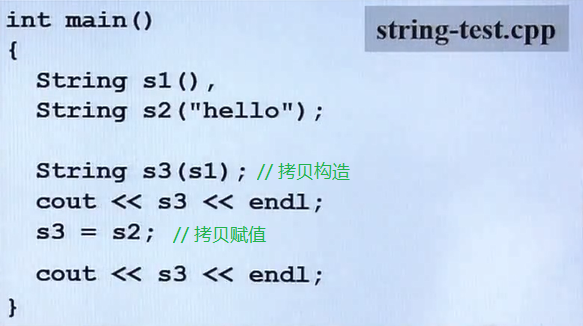
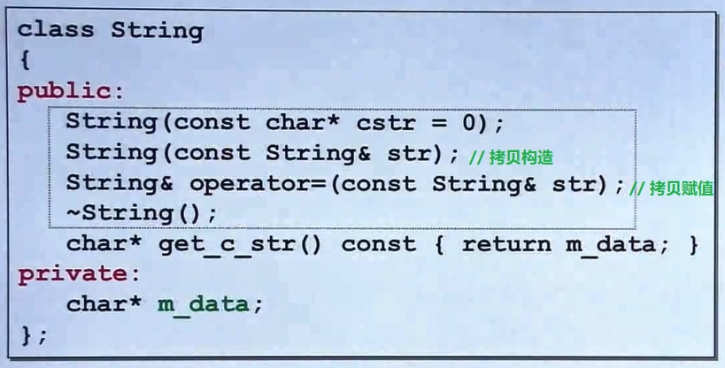
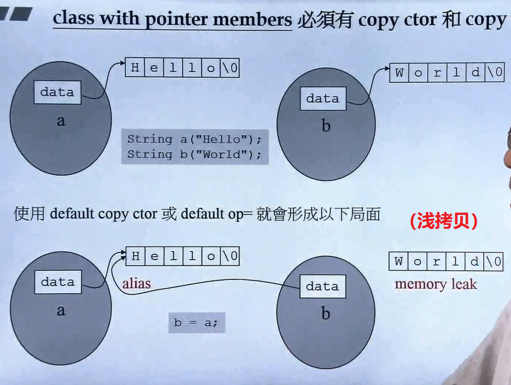
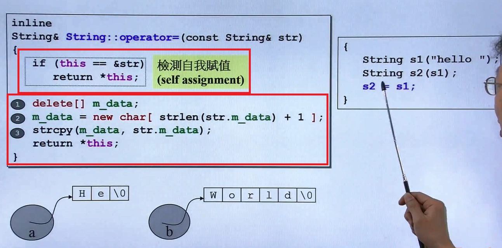

# c++函数

## 拷贝构造与拷贝赋值

只要类带有指针，一定要写这两个函数

### 1. 拷贝赋值&运算符重载 调用时的区别

#### 1. 拷贝赋值：

``A obj1;``
``A obj2=obj1;`` 或 ``A obj2(obj1);``

#### 2. 运算符重载：

``A obj1;``
``A obj2;``
``obj2=obj1;``

### 2. 深拷贝与浅拷贝

之所以说：带有指针的类一定要自己定义【拷贝构造】和【拷贝赋值】函数，是因为如果不写的话，c++默认对于指针的拷贝是浅拷贝，拷贝后的两个指针会指向**同一块地址区间**。
而自己定义后进行的深拷贝，不仅拷贝指针，也拷贝指针指向的内容，拷贝后的两个指针指向**不同的内存区间**。

### 3.拷贝赋值的写法

如果要将x拷贝赋值给y（即y=x）：
1. 将y清空
2. 给y分配和x一样的大小空间
3. 将x赋值给y

