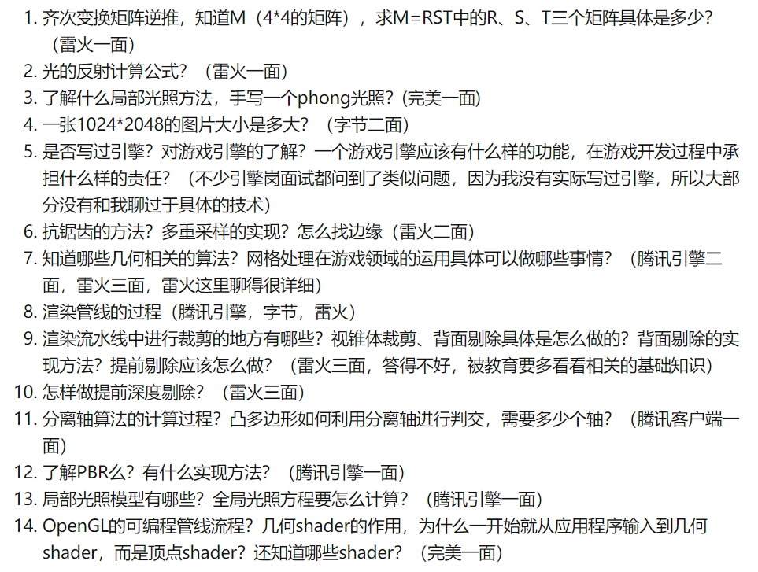

# 游戏客户端开发面经总结

## 必问

1. 多态的底层实现，紧接着可能会问虚函数的内存布局，包含虚函数的对象本身的内存大小问题，多继承问题等

2. 虚析构函数的作用

3. 虚函数的默认参数问题，以及为什么会这样，默认参数具体存在哪个C++分区等？

4. STL中vector的实现原理，map的实现原理（有序和无序）

   * `vector采用的数据结构是线性的连续空间，vector动态增加大小时，并不是在原空间之后持续新空间（因为无法保证原空间之后尚有可供配置的空间），而是以原大小的两倍另外配置一块较大的空间，然后将原内容拷贝过来，然后才开始在原内容之后构造新元素，并释放原空间。因此， 对vector的任何操作，一旦引起空间重新配置，指向原vector的所有迭代器就都失效了 。`

   * `STL中map的实现是基于红黑树的,`

5. 深拷贝、浅拷贝的区别

   `如果我们不自己定义拷贝构造函数，那么系统调用的默认拷贝构造函数是浅拷贝，它不会拷贝指针所指向的地址。也就是拷贝之后会出现两个指针指向的是同一块内存空间，这会导致在程序结束时同一块内存空间被释放两次，造成内存泄露的问题。`

   

6. C++内存分区有哪些

7. C++11智能指针

## 一、c++

### 腾讯

1. 什么是C++的虚函数和虚表？
2. 如何实现多态？
3. 子类继承父类后，虚函数表的内容是否一样？
4. C++右值引用的作用，右值是什么等等
5. 用内存拷贝的方式直接拷贝vector本身会发生什么？会存在什么陷阱？
6. C++ STL中存在的陷阱，你碰到过哪些？

### 网易互娱

1. 浮点数如何存储
2. 简述C++多态，运行期的多态有什么好处？
3. A、B、C链式继承，最后一共有多少个虚函数表
4. 构造函数可以是虚函数吗？析构函数可以是虚函数吗？
5. C++异常了解吗？发生异常语言层会做什么事？
6. 说一下常用容器？map是怎么实现的？
7. melloc与new的区别？以及new的优点
8. new分配的是虚拟每次还是物理内存？（操作系统的虚存机制）
9. 写一个程序，使它编译成功，链接失败？
10. 定义一个类T，使得vector<T>和T a[10]这两个定义，一个成功，一个失败。

### 巨人网络

1. Const关键字

const修饰常量、const修饰指针常量、常量指针、不可修改的特性、const修饰函数：两种方法，放在前面和放在后面，对比

2. C++面向对象的特性
3. 多态
4. 程序内存管理
5. 对比栈和堆
6. C++11、C++14、C++17对比，新特性
7. C++11分STL库的shared_ptr指针
8. stl 与 boost 熟悉吗?
9. map和set底层怎么实现的？元素有序吗？
10. 怎样避免一个对象给另外一个对象赋值？

### 微软

1. 虚函数、虚继承、函数重载、多重继承、智能指针等等概念

### 莉莉丝

1. 拷贝、指针、引用相关知识
2. hash表的构造、插入，查询和**删除**具体各有哪些方式？
3. map中红黑树的实现？以及对红黑树的了解？ 无序map和有序map的差别、优缺点？自定义数据结构怎么使用map？
4. 如果给定很多用户，其中key值可能包含地区、单位等两到三个。如果让你来设计，你会采用红黑树这种方式还是hash表这种方式来进行存储查询，为什么？

### 字节

1. sizeof和strlen的区别，以及字符串的sizoef计算中\0和八进制转义字符问题，例如sizeof(“123\04567”)。引申有十六进制转义字符问题

## 二、算法（多为笔试题）

### 腾讯

1. 了解排序？写一下快排

### 网易

1. 斐波那契数列的第n项?分析递归算法复杂度?有没有比O(n)更快的算法？快速幂怎么算？

### 莉莉丝

1. 寻找环链表的环入口

## 三、Unity

## 四、设计模式

### 腾讯

1. 游戏都有哪些设计模式？讲一下单例模式
2. 会不会写shader？

## 五、计算机网络

### 腾讯

1. tcp和udp的区别

### 网易

1. 进程和线程的区别
2. 什么是协程？
3. 操作系统的抢占式调度和非抢占式调度？
4. 假设一个线程sleep睡个十秒，这是怎么样的一个进程调度？
5. 动态链接中什么是共享的？什么是不共享的？动态库中有一些全局变量怎么办？全局变量是一份吗？一份不就互相冲突了吗？
6. TCP端来连接时几次挥手？为什么？
7. 写一个环形缓冲区

### 巨人网络

1. windows系统的消息机制
2. 线程安全
3. 死锁产生的原因
4. tcp 连接有多少种状态? 怎样查看 tcp 连接状态?
5. 线程之间的通信方式有哪些？
6. 使用全局比那里需要加锁吗？不加锁会有什么后果？
7. 用过哪些锁？

## 六、游戏引擎

### 莉莉丝

1. 渲染序列是怎样的，渲染效率有什么提升方法

   以某一款引擎为例，写一下其相关做法，比如COCOS在做渲染是用了RenderCommond|Group，以及异步加载的方式，都可以写。

​		不管你会不会某个语法和库功能细节的底层知识，你考虑问题首先要把自己放在一个语言设计者或是标准库设计者的位置来思考这个问题，这样不管你的回答是否正确，至少在面试官眼中，你都是以一个底层设计者的思路在设计，而不只是一个使用者