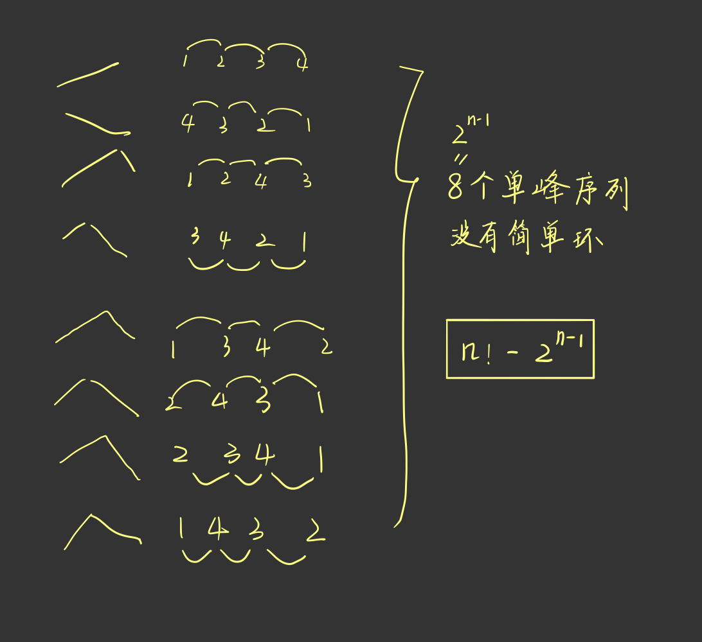

# [1391C - Cyclic Permutations](https://codeforces.com/contest/1391/problem/C)

## 题解

当n=4时，一共4!=24种排列方式，其中不能形成环的有以下8种情况，他们都是单峰序列共$2^{n-1}$种。

因此答案为$(n!-2^{n-1})$% $(10^9+7)$



## 代码

```c++
#include<bits/stdc++.h>
using namespace std;
const long long mod = 1e9 + 7;
long long qpow(long long a,long long n)
{
    long long sum=1;
    while(n)
    {
        if(n&1)
            sum = sum * a % mod;
        a = a * a % mod;
        n >>= 1;
    }
    return sum;
}
long long n, ans1 = 1, ans2 = 1;
int main()
{
    scanf("%lld", &n);
    for (long long i = 2; i <= n;i++)
    {
        ans1 = (ans1 * i) % mod;
    }
    ans2 = qpow(2ll, n - 1);
    ans1 = (ans1 - ans2 + mod) % mod;
    printf("%lld\n", ans1);
    //system("pause");
    return 0;
}
```

