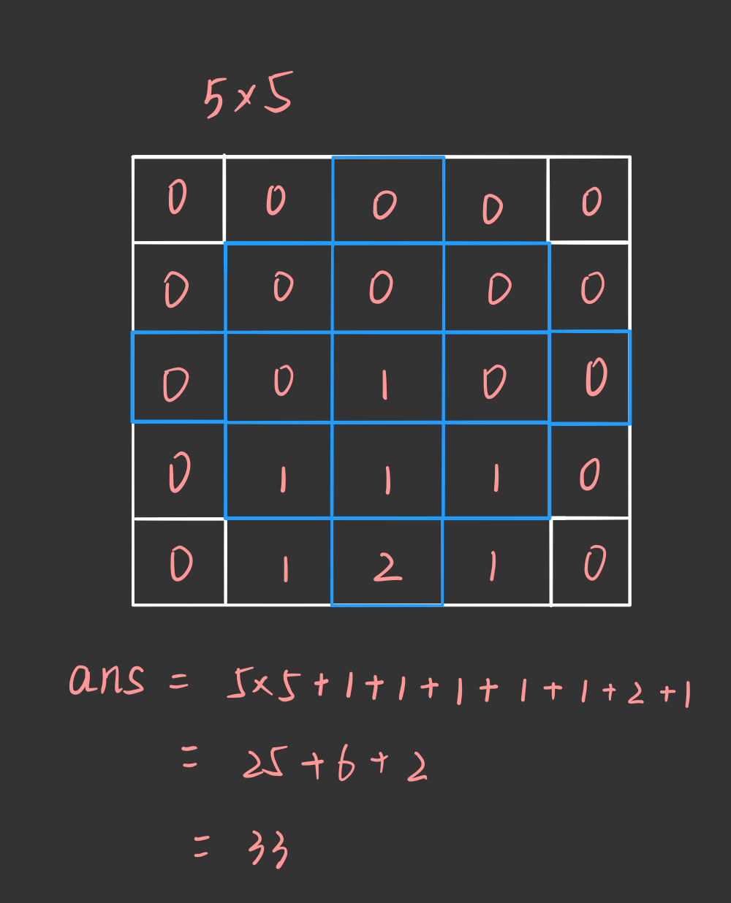

# [1393D - Rarity and New Dress](https://codeforces.com/problemset/problem/1393/D)

## 题解

`(i,j)`是2*2菱形的最下端的点，因此i的范围为`[3,n]`，j的范围为`[2,m)`

（不令`(i,j)`为菱形中心点的原因是：从上到下从左到右遍历的时候，最下面和最右边的点还未被更新）

菱形的贡献是中心点到端点的距离，则令`dp[i][j]`的值为：菱形中其他三个点的最小值+1



## 代码

```cpp
#include <bits/stdc++.h>
using namespace std;
const int maxn = 2005;
int n, m,dp[maxn][maxn];
char ch[maxn][maxn];
int main()
{
    scanf("%d%d", &n, &m);
    for (int i = 1; i <= n; i++)
    {
        getchar();
        for (int j = 1; j <= m; j++)
        {
            scanf("%c", &ch[i][j]);
        }
    }
    int ans = n * m;	//单独一个格子的数量
    for (int i = 3; i <= n; i++)
    {
        for (int j = 2; j < m; j++)
        {
            if(ch[i][j]==ch[i-1][j]
            &&ch[i][j]==ch[i-2][j]
            &&ch[i][j]==ch[i-1][j-1]
            &&ch[i][j]==ch[i-1][j+1])   //i,j为2*2菱形格子的最下面点的坐标
            {
                //dp[i][j]=上面三个格子的最小值+1
                dp[i][j] = min(dp[i - 1][j], dp[i - 2][j]);
                dp[i][j] = min(dp[i][j], dp[i - 1][j - 1]);
                dp[i][j] = min(dp[i][j], dp[i - 1][j + 1]);
                dp[i][j]++;
            }
            ans += dp[i][j];
        }
    }
    printf("%d\n", ans);
    //system("pause");
    return 0;
}
```

